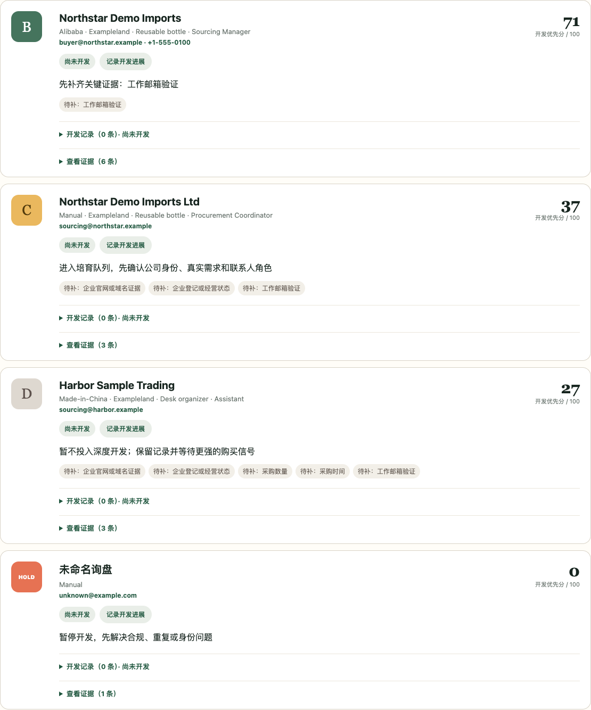

# Lydia export-sales workbench

A local-first workbench for turning existing export-sales inquiries into an evidence-led follow-up queue. Import your CSV or JSON, review grades and missing information, and decide the next action yourself. The current interface is in Chinese; this guide is in English.



The screenshot uses fictional companies, contacts, and inquiry data from this repository. It is not evidence of customers, sales, or validated scoring weights.

## Start with the sample

Requires **Node.js 20 or newer** and a modern browser. The workbench does not require third-party package installation.

```sh
git clone https://github.com/lydiahub19921013/lydia-foreign-trade-system.git
cd lydia-foreign-trade-system
npm run workbench
```

Open the local address printed in the terminal, normally `http://127.0.0.1:4173`. Click **使用虚构样例** (“Use fictional sample”), review the column mapping, then click **确认映射并导入** (“Confirm mapping and import”). Review the grade summary, inquiry cards, missing evidence, and suggested next actions. This sample workflow needs no API key and does not require your customer data. Press `Ctrl+C` in the terminal to stop the server.

You can also try the command-line qualifier:

```sh
npm run qualify -- examples/inquiries.sample.csv
npm run check
```

## Follow one inquiry through the workflow

1. **Import:** select a CSV or JSON file. For CSV files, review the detected columns and sample values before confirming the mapping. Common platform fields are supported as candidates; they are not a guarantee of compatibility with every export format.
2. **Review:** inspect the A / B / C / D / HOLD grade, missing evidence, and next action. A grade is an aid to prioritization, not a guarantee of creditworthiness or a purchase.
3. **Verify when needed:** explicitly request public company, website, or domain checks. Search snippets, website claims, and generated email addresses remain candidates unless independently verified.
4. **Keep records:** record follow-up stages manually. Separate customer workspaces and export a complete workspace backup for important batches.

## Privacy and limits

- Inquiry and relationship files are processed in the local browser. Workspace data is stored in IndexedDB; it is **not encrypted**, and a workspace is not an account-permission boundary or cloud backup.
- Public research runs only after the relevant user action. Exa receives selected public search terms; GLEIF receives a company name and optional jurisdiction. See the [full Chinese README](../README.md) for each integration's data boundary.
- The system does not automatically send messages, sign documents, merge customer identities, or accept candidate data as established fact.
- Scoring weights need calibration against real outcomes. The sample demonstrates a workflow, not predictive accuracy.
- Exa research is optional and requires the separately configured Agent Reach integration. The local sample, import, and qualification workflow works without it.

## Reuse and contribute

The project uses the [MIT License](../LICENSE). See [third-party notices](../THIRD_PARTY_NOTICES.md) for attribution boundaries and [CONTRIBUTING.md](../CONTRIBUTING.md) for safe bug reports. Share minimal fictional examples, not customer records or credentials.
